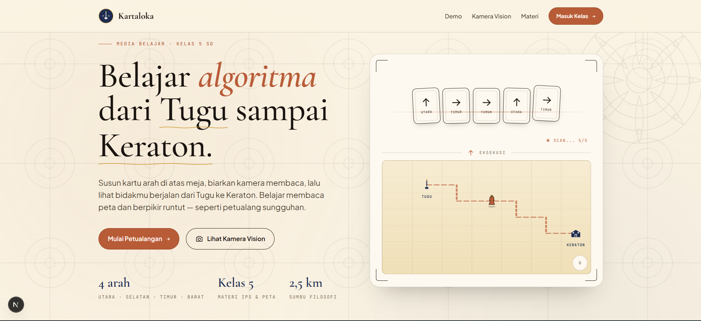
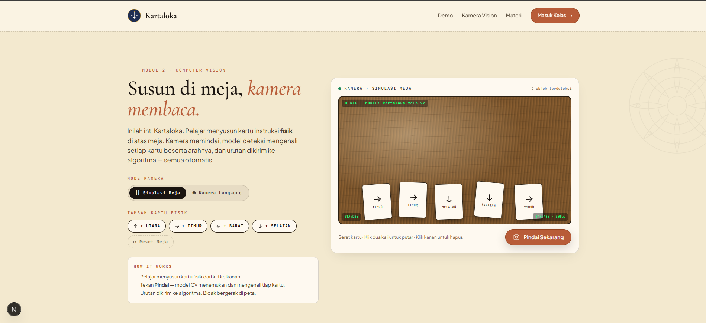

# Kartaloka

Media pembelajaran algoritma berbasis kartu fisik untuk siswa **kelas 5 SD**, dengan tema peta Sumbu Filosofi Yogyakarta.

Siswa menyusun kartu instruksi fisik (Utara / Selatan / Timur / Barat) di atas meja, kamera membaca susunannya secara otomatis, lalu bidak digital bergerak di peta dari Tugu menuju Keraton.

---

## Tampilan

### Hero — Beranda



### Kamera Vision — Pindai Kartu Fisik



---

## Struktur Project

```
Kartaloka/
├── kartaloka-web/        # Frontend — Next.js 16 + TypeScript
│   ├── src/app/          # App Router (layout, halaman, API route)
│   └── src/components/   # Hero, DemoPanel, CameraPanel, shared
│
├── ml/                   # Machine Learning — YOLOv8-OBB
│   ├── api/              # FastAPI inference server
│   │   └── server.py
│   ├── data/             # Dataset (train/valid/test, dari Roboflow)
│   ├── raw_data/         # Foto kartu fisik untuk training
│   ├── runs/             # Hasil training & export model
│   │   ├── train/        # Checkpoint per versi
│   │   └── export/       # best.onnx — model siap pakai
│   ├── scripts/          # Pipeline training
│   │   ├── collect_data.py
│   │   ├── prepare_dataset.py
│   │   ├── train.py
│   │   └── export.py
│   ├── weights/          # Base model (yolov8n-obb.pt)
│   └── requirements.txt
│
├── docs/                 # Screenshot untuk README
├── data.yaml             # Konfigurasi dataset YOLO
├── start-dev.ps1         # Script jalankan semua server sekaligus
└── README.md
```

---

## Persyaratan

### Python
- Python 3.12+
- GPU NVIDIA (opsional, untuk training — CPU cukup untuk inferensi)

### Node.js
- Node.js 18+
- npm 9+

---

## Instalasi

### 1. Clone repository

```bash
git clone https://github.com/ImBarka/kartaloka.git
cd kartaloka
```

### 2. Install dependensi Python

```bash
pip install -r ml/requirements.txt
```

### 3. Install dependensi Node.js

```bash
cd kartaloka-web
npm install
cd ..
```

### 4. Konfigurasi environment

Buat file `kartaloka-web/.env.local`:

```
CV_API_URL=http://localhost:8001
```

---

## Menjalankan Lokal

### Cara cepat — satu script

```powershell
.\start-dev.ps1
```

Script ini membuka dua terminal:
- **API server** di `http://localhost:8001`
- **Web server** di `http://localhost:3000`

### Cara manual

**Terminal 1 — API server:**
```bash
uvicorn ml.api.server:app --host 0.0.0.0 --port 8001
```

**Terminal 2 — Web server:**
```bash
cd kartaloka-web
npm run dev
```

Buka browser: `http://localhost:3000`

---

## Cara Pakai

### Demo Interaktif (tanpa kamera)
1. Buka `http://localhost:3000`
2. Scroll ke bagian **Demo**
3. Klik kartu Utara / Selatan / Timur / Barat untuk menyusun algoritma
4. Klik **▶ Eksekusi** — bidak bergerak di peta
5. Klik **Beri Petunjuk** untuk melihat solusi rute Tugu → Keraton

### Kamera Vision (dengan kartu fisik)
1. Buat kartu fisik: **background putih, panah hitam**, 4 arah
2. Scroll ke bagian **Kamera Vision**
3. Klik **Kamera Langsung**
4. Susun kartu di meja dari kiri ke kanan
5. Klik **Pindai Sekarang**
6. Klik **Kirim ke Algoritma** → bidak bergerak otomatis

#### Spesifikasi kartu fisik
| | |
|---|---|
| Background | Putih solid |
| Panah | Hitam, tebal |
| Ukuran | Min. 10×10 cm |
| Jumlah | 4 kartu (Utara, Selatan, Timur, Barat) |

---

## Training Model (opsional)

Model sudah tersedia di `ml/runs/export/best.onnx`. Langkah ini hanya diperlukan jika ingin melatih ulang dengan data baru.

### 1. Kumpulkan foto kartu fisik

```bash
python ml/scripts/collect_data.py --class up    # Utara
python ml/scripts/collect_data.py --class down  # Selatan
python ml/scripts/collect_data.py --class right # Timur
python ml/scripts/collect_data.py --class left  # Barat
```

Kontrol: `SPACE` = ambil foto, `A` = auto-capture, `Q/ESC` = selesai

### 2. Anotasi dataset

Upload foto ke [Roboflow](https://roboflow.com), anotasi dengan label `up/down/left/right`, export format **YOLOv8 OBB**, extract ke root project.

### 3. Training

```bash
python ml/scripts/prepare_dataset.py
python ml/scripts/train.py
```

Hasil disimpan di `ml/runs/train/kartaloka-obb/weights/best.pt`.

### 4. Export ONNX

```bash
python ml/scripts/export.py
```

Model diekspor ke `ml/runs/export/best.onnx`.

### 5. Restart API server

```bash
uvicorn ml.api.server:app --host 0.0.0.0 --port 8001
```

---

## Kelas Dataset

| Class | Indeks | Arah |
|-------|--------|------|
| up    | 3      | Utara |
| down  | 0      | Selatan |
| right | 2      | Timur |
| left  | 1      | Barat |

---

## Tech Stack

| Bagian | Teknologi |
|---|---|
| Frontend | Next.js 16, React 19, TypeScript |
| CV Model | YOLOv8n-OBB (ultralytics 8.4) |
| Inference | ONNX Runtime + FastAPI |
| Training | PyTorch 2.5, CUDA |
| Dataset | Roboflow — kartu fisik arah mata angin |
